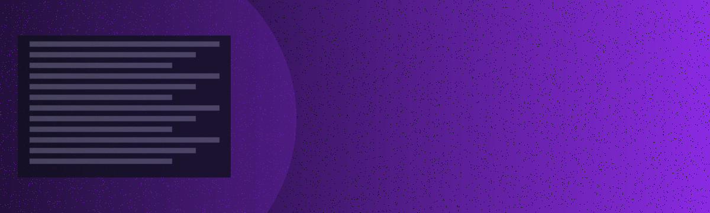

# Hi, I'm **byKenvi** 👋 / Salut, je suis **byKenvi** 👋

<p align="center">
  <!-- Banner image: place banner_byKenvi.png at the repo root as ./banner.png -->
  
</p>

<p align="center">
  
</p>

---

## 🇫🇷 À propos / About me 🇬🇧

* Passionné par le **code propre**, les architectures modernes et l'automatisation. / Passionate about **clean code**, modern architectures and automation.
* J'aime concevoir des solutions élégantes, performantes et bien testées. / I design elegant, high-performance, well-tested solutions.
* Langues / Languages: **Français** · **Anglais**

---

## ⚒️ Compétences / Tech Stack


---

## 📫 Contact

* Email: **[lihounhintoe@gmail.com](mailto:lihounhintoe@gmail.com)**
* LinkedIn: [open profile](https://www.linkedin.com)

---

## 📈 Stats & Visuals

<p align="center">
  
  
</p>

<p align="center">
  
</p>

> **Nota / Note:** Si les visuels ne s'affichent pas immédiatement, vérifie que le nom d'utilisateur dans les URLs (`byKenvi`) correspond bien à ton pseudo GitHub.

---

## 🔧 Principes de travail / Work Principles

* Clean code, tests, PRs soignés. / Clean code, tests, tidy PRs.
* Automatisation progressive: CI/CD, linting, tests unitaires et e2e.
* Documentation : README concis + examples.

---

## 🧩 Enigmes & Challenges / Puzzles (révèle la réponse en cliquant)

### 1) Dev Puzzle / Énigme dev

**Q:** What value will `result` hold after this snippet? / Quelle valeur `result` contiendra après ceci?

```javascript
const arr = [1, 2, 3];
const result = arr.map(x => x * 2).filter(x => x > 3).reduce((s, v) => s + v, 0);
console.log(result);
```

<details>
  <summary>Answer / Réponse</summary>
  - Steps / Étapes : map → [2,4,6] ; filter x>3 → [4,6] ; reduce → 10. So `result` is **10**.
</details>

---

### 2) Logic Puzzle / Puzzle logique

**Q:** Je pense à un nombre. Multiplié par 3, puis on ajoute 6, on obtient 21. Quel est le nombre ? / I think of a number. Multiply by 3, add 6, you get 21. What is it?

<details>
  <summary>Answer / Réponse</summary>
  (21 - 6) / 3 = 5 → **5**.
</details>

---

### 3) Bonus: Mini-challenge (à cloner) / Mini challenge

* Clone ce repo, ouvre `challenge/README.md` et résous l'exo en 24h. 🔒 (Tu peux transformer ça en GitHub issue et tracker ton temps.)

---

## 🔮 Extras (animations & astuces)

* *Typing SVG* en haut : l'URL pointe vers un service public qui génère une animation SVG. Tu peux modifier le texte en changeant `lines=` dans l'URL.
* *Activity graph* & *stats* viennent de services gratuits (activity-graph, github-readme-stats). Si tu veux d'autres thèmes ou styles, je peux les ajuster.

---

## ✅ How to use / Comment l'utiliser

1. Crée un repo nommé exactement **`byKenvi`** sur GitHub.
2. Colle le contenu de ce fichier dans le `README.md` du repo.
3. Push — GitHub affichera automatiquement ce README sur ta page de profil.

---

<p align="center">Made with ❤️ · Contribuer proprement · / Crafted with ❤️ · Clean contributions</p>
